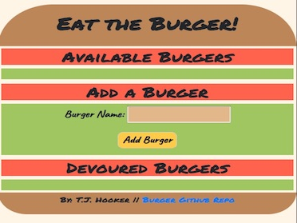

# Eat The Burger App
By: T.J. Hooker

Date: June 3, 2018

### Overview
Eat the Burger app is a MVC design pattern restaurant app that let's user input the names of the burgers they'd like to eat. The user's burger is displayed on the left hand side (or top if using a smaller screen). Each burger has a devour button and progress bar for the user to devour the hamburger. When the user clicks the devour button enough times, the burger moves to the right hand side (or bottom if using a smaller screen). The user can "re-order" a devoured burger by clicking the re-order button. All user's burgers are stored in a database. 

### Tech Used
* JavaScript
* jQuery
* Bootstrap
* node.js
* express
* body-parser
* mySQL
* handlebars.js
* ORM
* Heroku

### How it works
The user is initially presented with either a blank burger to enter burger names or, if users have already entered values, a list of previously entered burgers. The user can either devour a burger by clicking on the devour button 5 times, enter a new burger, or re-order a previously devoured burger by clicking on the button once. 

The server.js file communicates directly with the controller file. The controller handles the routing and calls to burger.js and sends user inputs as parameters to the burger.js. The burger.js file passes user input to the orm.js. The orm.js contains a homemade ORM that provides a database model. The ORM inserts all info passed to it through parameters and makes queries to SQL.
 
The front end is handled by jQuery and ajax calls. The display is handled by Handlebars which generates the HTML of the app. 
